## 渲染一个三角形

### 定义顶点

```c
float vertices[] = {
    -0.5f, -0.5f, 0.0f,
    0.5f, -0.5f, 0.0f,
    0.0f, 0.5f, 0.0f
}
```

利用顶点缓存对象(Vertex Buffer Object)来存储顶点数据, 它存在GPU显存中.

申请VBO

```c
unsigned int VBO;
glGenBuffers(1, &VBO); // 生成唯一ID
```

拿到ID, 但是不知道这个ID表示什么类型的数据, 指明这个是顶点缓存对象

```c
glBindBuffer(GL_ARRAY_BUFFER, VBO); // 指定为顶点缓存对象
```

将顶点数据复制到VBO

```c
glBufferData(GL_ARRAY_BUFFER, sizeof(vertices), vertices, GL_STATIC_DRAW);
/**
 * 参数1: 我们的顶点数据需要拷贝到的地方 (之前我们绑定的VBO)
 * 参数2: 数组的大小
 * 参数3: 数组的地址
 * 参数4: 指定显卡要采用什么方式来管理我们的数据, GL_STATIC_DRAW表示这些数据不会经常改变
**/
```

### 顶点着色器

```glsl
#version 330 core
layout (location = 0) in vec3 aPos;

void main() {
    gl_Position = vec4(aPos.x, aPos.y, aPos.z, 1.0);
}

/**
 * 第一行: 指明了使用OpenGL的版本以及运行模式(版本号3.3, 核心模式)
 * 第二行: 指明了需要从上一个步骤中获取一个vec3类型的位置数据, 数据位置在输入数据的0偏移位置(类似于
 *        输入了一块数据, 我们要的数据在头部)
 * 第七行(main函数内部): 将顶点的位置直接赋值成输入的位置, gl_Position是一个内置的变量, 用来表示
 *        顶点位置的
**/
```

编译着色器

```c
// 创建着色器对象
unsigned int vertexShader;
vertexShader = glCreateShader(GL_VERTEX_SHADER);

// 编译着色器
glShaderSource(vertexShader, 1, &vertexShaderSource, NULL);
glCompileShader(vertexShader);
```

### 顶点着色器

```glsl
#version 330 core
out vec4 FragColor;

void main() {
    FragColor = vec4(1.0f, 0.5f, 0.2f, 1.0f);
}
```

编译着色器

```c
// 创建片元着色器对象
unsigned int fragementShader;
fragementShader = glCreateShader(GL_FRAGMENT_SHADER);
glShaderSource(fragmentShader, 1, &fragmentShaderSource, NULL);
glCompileShader(fragmentShader);
```

### 着色器程序对象

```c
// 链接着色器
unsigned int shadeProgram;
shaderProgram = glCreateProgram();
glAttachShader(shaderProgram, vertexShader);
glAttachShader(shaderProgram, fragmentShader);
glLinkProgram(shaderProgram);
```

### 使用着色器程序对象

```c
// 使用着色器对象
glUseProgram(shaderProgram);
```

### 清理着色器

将已经附加过的着色器都清除掉, 已经不再需要了

```c
glDeleteShader(vertexShader);
glDeleteShader(fragmentShader);
```

### 指明顶点属性

我们可以输入想要输入的任何属性格式, 定义的顶点格式如下:

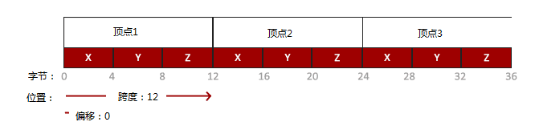

我们的起始顶点的偏移为0, 每个位置分量占用4字节的空间, 一个顶点占用12字节空间, 于是, 指定顶点格式

```c
// 指明顶点格式
glVertexAttribPointer(0, 3, GL_FLOAT, GL_FALSE, 3 * sizeof(float), (void *)0);
glEnableVertexAttribArray(0);
/**
 * 参数1: 指明我们想要配置的顶点属性. 类似编号的东西, 之前我们设置了location = 0, 
 *       就是我们在这里用到的0
 * 参数2: 顶点属性的大小. 我们用到的顶点是一个vec3的结果, 所以大小为3
 * 参数3: 数据的类型. 我们使用的是float类型
 * 参数4: 指明数据是否要被规范化. 这里我们设置成FALSE, 不用规范化, 因为我们已经规范化好了.
 * 参数5: 表示属性的跨度. 正如之前我们分析的, 我们的跨度是12, 就是3倍的float类型
 * 参数6: 指明了数据的起始偏移量. 这里转成了一个void *指针类型比较奇怪
**/
```

我们获取的顶点数据是由VBO决定的, 而glVertexAttribPointer操作的是当前绑定到GL_ARRAY_BUFFER上的VBO, 所以, 我们当前操作的就是我们之前生成并绑定的那个VBO.

glEnableVertexAttribArray(0)是用来让顶点属性生效的, 参数0就是我们之前配置的那个顶点属性的位置.

### 绘制三角形

```c
glDrawArrays(GL_TRIANGLES, 0, 3); // 0表示顶点数据的起始索引, 3表示有3个顶点
```

顶点数组对象(Vertex Array Object), 作用是来保存对顶点属性的调用. 这样, 当我们需要这些顶点属性的时候, 只需要简单地绑定VAO, 不需要再设置一遍顶点属性就可以进行绘制.(如果不想保存, 只想显示, 不用VAO, 是不能显示出图像的)

VAO会保存两种东西:

一是对glEnableVertexAttribArray或者是glDisableVertexAttribArray的调用

二是使用glVertexAttribPointer设置的顶点属性以及与顶点属性相关连的VBO

```c
// 这段代码添加到生成VBO的代码之后
unsigned int VAO;
glGenVertexArrays(1, &VAO);
glBindVertexArray(VAO);
```

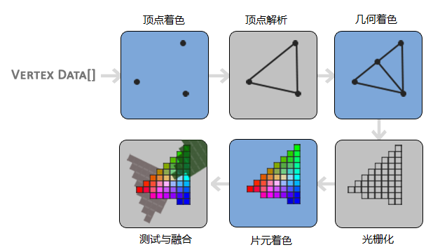

这是一张顶点处理的流程图, 我们所做的工作就是处理其中的一些阶段. 顶点着色和片元着色.

## 元素缓存对象

### 元素缓存对象(EBO: Element Buffer Object)

在数组中标识出位置, 使用位置来绘制图像, 表面了大量存储重复数据. 解决了冗余数据的问题.

使用EBO的方式和使用VBO的方式一样, 先生成一个唯一ID, 然后绑定到OpenGL, 再然后将定义好的索引数组保存到EBO中去, 最后进行绘制.

### 定义顶点数组和索引数组

4个顶点, 5个索引

```c
float rectVertices[] = {
    0.5f, 0.5f, 0.0f,    // 右上角
    0.5f, -0.5f, 0.0f,   // 右下角
    -0.5f, -0.5f, 0.0f,  // 左下角
    -0.5f, 0.5f, 0.0f    // 左上角
};

unsigned int indices[] = {
    0, 1, 3,  // 第一个三角形
    1, 2, 3   // 第二个三角形
};
```

### 获取唯一ID

```c
unsigned int EBO;
glGenBuffer(1, &EBO);
```

### 绑定到OpenGL

绑定VBO的参数是GL_ARRAY_BUFFER, 绑定EBO需要的是GL_ELEMENT_ARRAY_BUFFER

```c
glBindBuffer(GL_ELEMENT_ARRAY_BUFFER, EBO);
```

### 复制索引数据到EBO中去

还是使用glBufferData, 不过复制的时候需要指明是EBO, 所以, 要用GL_ELEMENT_ARRAY_BUFFER参数

```c
glBufferData(GL_ELEMENT_ARRAY_BUFFER, sizeof(indices), indices, GL_STATIC_DRAW);
```

### 绘制

绘制VBO使用glDrawArrays函数, 绘制EBO就要使用glDrawElements函数

```c
glDrawElements(GL_TRIANGLES, 6, GL_UNSIGNED_INT, 0);
```

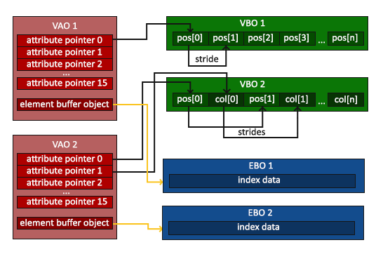

## 着色器类

### 着色器代码的格式

```glsl
#version 版本号
in 数据类型 变量名;
out 数据类型 变量名;
uniform 数据类型 变量名;
void main() {
    // 处理过程
    输出变量 = 处理结果;
}
```

in表示从上一个阶段输入的数据, out表示这个阶段需要输出的数据, uniform表示全局的数据(应用里也能读取和写入这个变量, 这就是着色器和应用之间胡同数据的方法), 主函数main这能够包含了处理过程, 将处理结果赋值给输出变量

### 着色器之间的数据互通

```c
// 顶点着色代码
const char *vertexShaderSource = "#version 330 core\n"
    "layout (location = 0) in vec3 aPos;\n"
    "out vec3 ourColor;\n"
    "void main()\n"
    "{\n"
    "    gl_Position = vec4(aPos, 1.0);\n"
    "    ourColor = vec3(0.5f, 0.0f, 0.0f);\n"
    "}\0";

// 片元着色器代码
const char *fragmentShaderSource = "#version 330 core\n"
    "out vec4 FragColor;\n"
    "in vec3 ourColor;\n"
    "void main()\n"
    "{\n"
    "    FragColor = vec4(ourColor, 1.0f);\n"
    "}\0";
```

### 着色器和应用之间的数据互通

```c
// 片元着色器代码
const char *fragmentShaderSource = "#version 330 core\n"
    "out vec4 FragColor;\n"
    "uniform vec4 ourColor;\n"
    "void main()\n"
    "{\n"
    "    FragColor = ourColor;\n"
    "}\0";
```

要使用uniform, 需要两步:

- 获取该变量在着色器程序中的位置(这里是着色器程序, 不是片元着色器, 是顶点着色器和片元着色器链接进入的那个着色器程序)

- 通过glUniform4fv函数对其进行赋值

```c
float greenValue = 1.0f;
int ourColorLocation = glGetUniformLocation(shaderProgram, "ourColor");
glUseProgram(shaderProgram);
glUniform4f(ourColorLocation, 0.0f, greenValue, 0.0f, 1.0f);
```

## 纹理

### 什么是纹理

纹理, 英文是texture, 指的是一张二维的图片, 可以贴到物体上.

### 映射方式

以左下角为原点, 向右伸展到1.0的位置, 向上伸展到1.0的位置, 表示一整张的纹理图像.

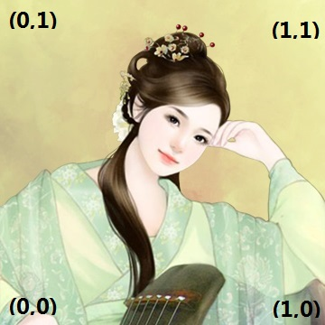

### 纹理环绕方式(Texture Wrapping)

通常, 纹理坐标的范围在(0, 0)到(1, 1)之间, 但是如果我们制定的坐标在这之外呢? OpenGL会重复绘制纹理图.

也提供了更多的选择方案:

* GL_REPEAT: 默认方案, 重复纹理图片
* GL_MIRRORED_REPEAT: 类似于默认方案, 不过每次重复的时候进行镜像重复
* GL_CLAMP_TP_EDGE: 将坐标限制在0到1之间, 超出的坐标会重复绘制边缘的像素, 变成一种扩展边缘的图案
* GL_CLAMP_TO_BORDER: 超出的坐标将会被绘制成用户指定的边界颜色

每种方案的显示效果截然不同

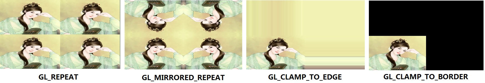

设置纹理环绕方式的方法是调用glTexParameteri函数, 具体方式如下:

```c
glTexParameteri(GL_TEXTURE_2D, GL_TEXTURE_WRAP_S, GL_REPEAT); // 横坐标
glTexParameteri(GL_TEXTURE_2D, GL_TEXTURE_WRAP_T, GL_REPEAT); // 纵坐标
```

如果设定了GL_CLAMP_TO_BORDER的环绕方式, 想要指定边界颜色, 就需要使用glTexParameterfv函数

```c
// 在设置了环绕方式之后再调用
float borderColor[] = {1.0f, 1.0f, 0.0f, 1.0f}; // 指定成黄色
glTexparameterfv(GL_TEXTURE_2D, GL_TEXTURE_BOEDER_COLOR, borderColor);
```

### 纹理过滤(Texture Filtering)

纹理坐标采用了浮点数的形式, 表明了它和分辨率无关. OpenGL需要非常精确的计算出纹理像素(通畅被称为纹素)和纹理坐标之间的对应关系. 当你有一张低分辨率的纹理图, 但是需要用到一个非常大的物体上时, 这种操作的重要性就更加明显了. OpenGL提供了集中不同的方案来解决这个问题, 其中最重要的两种: GL_NEAREST和GL_LINEAR

* GL_NEAREST

  最近点过滤. 指的是纹理坐标最靠近哪个纹素, 就用哪个纹素. 这是OpenGL默认的过滤方式, 速度最快, 但是效果最差

* GL_LINEAR

  (双)线性过滤. 指的是纹理坐标位置附近的几个纹素值进行某种插值计算之后的结果. 这是应用最广泛的一种方式, 效果一般, 速度较快

效果图如下:

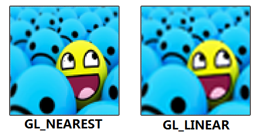

最近点过滤的像素痕迹非常明显, 而线性过滤的方式效果就好上很多, 虽然感觉很模糊, 但是我们完全能理解一张小图放大之后会模糊这件事

```c
// 设置过滤方式还是使用glTexParameteri
glTexParameteri(GL_TEXTURE_2D, GL_TEXTURE_MIN_FILTER, GL_NEAREST); // 缩小时的过滤方式
glTexParameteri(GL_TEXTURE_2D, GL_TEXTURE_MAG_FILTER, GL_LINEAR); // 放大时的过滤方式
```

### Mipmaps

所谓的mipmaps, 就是一系列的纹理图片, 每一张纹理图的大小都是前一张的1/4, 直到剩最后一个像素为止. 看起来


当物体越离越远的时候, 就可以选用较小纹理去映射, 这样不仅效果好, 而且速度也快.

可以通过glGenerateMipmaps来弄这个图片.

对于刚好在两张图片之间的物体, 我们可以参考前面两种过滤方式, 最近点(采用最近的图)或者线性(采用两张图的加权平均). 这样, 我们就有了四种不同的过滤方案.

* GL_NEAREST_MIPMAP_NEAREST: 采用最近的mipmap图, 在纹理采样的时候使用最近点过滤采样
* GL_LINEAR_MIPMAP_NEAREST: 采用最近的mipmap图, 纹理采样的时候使用线性过滤采样
* GL_NEAREST_MIPMAP_LINEAR: 采用两张mipmap图的线性插值纹理图, 纹理采样的时候采用最近点过滤采样
* GL_LINEAR_MIPMAP_LINEAR: 采用两张mipmap图的线性插值纹理图, 纹理采样的时候采用线性过滤采样

```c
glTexParameteri(GL_TEXTURE_2D, GL_TEXTURE_MIN_FILTER, GL_LINEAR_MIPMAP_LINEAR);  //都是线性过滤
// 注意: mipmaps是用来处理物体变小时如何进行贴图的问题, 所以需要设置GL_TEXTURE_MAG_FILTER成mipmap方式, 如果强行使用, 会报错
glTexParameteri(GL_TEXTURE_2D, GL_TEXTURE_MAG_FILTER, GL_LINEAR);
```

### 使用

#### 顶点数据

我们的顶点数组中需要三样东西: 位置, 颜色, 纹理坐标.

```c
float vertices[] = {
    // 位置               // 颜色           // 纹理坐标
     0.5f,   0.5f, 0.0f, 1.0f, 0.0f, 0.0f, 1.0f, 1.0f, // 右上角
     0.5f,  -0.5f, 0.0f, 0.0f, 1.0f, 0.0f, 1.0f, 0.0f, // 右下角
    -0.5f, -0.5f,  0.0f, 0.0f, 0.0f, 1.0f, 0.0f, 0.0f, // 左下角
    -0.5f,  0.5f,  0.0f, 1.0f, 1.0f, 0.0f, 0.0f, 1.0f // 左上角
}；
```

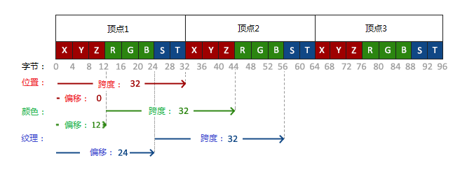

可以看到, 我们的跨度变成了32, 也就是8sizeof(float), 颜色的起始偏移值为3sizeof(float), 纹理的起始偏移值为6sizeof(float). 这样, 我们指定顶点属性的自然需要指定相应的位置和偏移.

颜色属性:

```c
glVertexAttribPointer(1, 3, GL_FLOAT, GL_FALSE, 8 * sizeof(float), (void *)(3 * sizeof(float)));
glEnableVertexAttribArray(1);
```

纹理属性:

```c
glVertexAttribPointer(2, 2, GL_FLOAT, GL_FALSE, 8 * sizeof(float), (void *)(6 * sizeof(float)));
glEnableVertexAttribArray(2);
```

顶点着色器

```glsl
#version 330 core

layout (location = 0) in vec3 aPos;
layout (location = 1) in vec3 aColor;
layout (location = 2) in vec2 aTexCoord;

out vec3 ourColor;
out vec2 TexCoord;

void main() {
    gl_Position = vec4(aPos, 1.0);
    ourColor = aColor;
    TexCoord = aTexCoord;
}
```

片元着色器

```glsl
#version 330 core

out vec4 FragColor;

in vec3 ourColor;
in vec2 TexCoord;

uniform sampler2D ourTexture;

void main() {
    FragColor = texture(ourTexture, TexCoord); // 对纹理指定位置进行采样
}
```

创建纹理

```c
unsigned int texture;
glGenTextures(1, &texture);

/**
 * 第一个参数是创建的纹理数量
 * 第二个参数是保存那么多数量的整型数组
**/
```

创建完之后, 我们需要绑定到OpenGL的环境里才能操作

```c
glBindTexture(GL_TEXTURE_2D, texture);
```

绑定完成后, 就把之前加载的图片数据放到纹理中去了

```c
glTexImage2D(GL_TEXTURE_2D, 0, GL_RGB, width, height, 0, GL_RGB, GL_UNSIGNED_BYTE, data);
/**
 * 参数一: 指定目标纹理. GL_TEXTURE_2D就表示当前的操作会对绑定的2D纹理产生作用(GL_TEXTURE_1D和GL_TEXTURE_3D里边的东西就不会受影响)
 * 参数二: mipmap层级. 我们之后会调用glGenerateMipmap来创建, 这里只需要创建原始图就行了
 * 参数三: 我们需要保存的纹理格式. 我们的图片只有RGB信息, 所以用GL_RGB格式
 * 参数四和参数五: 纹理图片的宽高
 * 参数六: 一定要设置成0
 * 参数七和参数八: 源图片的格式和数据类型. 我们加载的图片中有RGB值, 并且以字节的方式保存
 * 参数九: 加载的图片数据
**/
glGenerateMipmap(GL_TEXTURE_2D);
```

## 显示不同的纹理

### 纹理单元

纹理是通过纹理单元这个东西绑定到OpenGL环境中的. 纹理单元应该是OpenGL中内置的关于纹理的一些配置, OpenGL会根据这些配置来操作纹理. 在OpenGL中, 纹理单元的数量至少有16个, 我们可以通过GL_TEXTURE0 … GL_TEXUTRE15来激活使用. 默认激活的是GL_TEXTURE0, 所以我们之前的操作都是针对GL_TEXTURE0的.

让我们来激活另一个纹理单元并且对它进行一些操作.

首先, 我们用glActiveTexture(GL_TEXTURE1)来激活纹理单元1, 使之可操作.

然后, 将一个新的纹理ID绑定到这个纹理对象上, 我们不妨将这个新ID定义成texture2, 调用glBindTexture(GL_TEXTURE_2D, texture2)进行绑定.

接下来, 如同之前一样, 设置好环绕和过滤方式.

```c
glTexParameteri(GL_TEXTURE_2D, GL_TEXTURE_WRAP_S, GL_REPEAT);
glTexParameteri(GL_TEXTURE_2D, GL_TEXTURE_WRAP_T, GL_REPEAT);
glTexParameteri(GL_TEXTURE_2D, GL_TEXTURE_MIN_FILTER, GL_LINEAR_MIPMAP_LINEAR);
glTexParameteri(GL_TEXTURE_2D, GL_TEXTURE_MAG_FILTER, GL_LINEAR);
```

接着, 把图片加载进去, 绑定到当前的纹理单元上.

```c
glTexImage2D(GL_TEXTURE_2D, 0, GL_RGBA, width, height, 0, GL_RGBA, GL_UNSIGNED_BYTE, data);
glGenerateMipmap(GL_TEXTURE_2D);
```

最后, 我们需要告诉OpenGL着色器采样器和纹理单元之间的对应关系.

同时, 片元着色器也需要做相应的改动:

```c
uniform sampler2D texture1;
uniform sampler2D texture2;

void main() {
    FragColor = mix(texture(texture1, TexCoord), texture(texture2, TexCoord), 0.2);
}
```

mix函数是对某个点的纹理进行混合运算, 0.2表示该点的颜色20%来自采样器2, 80%来自采样器1.

### 融合因子控制

直觉上的, 我们需要三步走:

* 第一步: 定义一个全局的融合因子
* 第二步: 点击上下箭头的时候设置这个值
* 第三步: 设置这个融合因子变量值

## 转换(数学基础知识)

### 向量

向量就是用来表示方向的. 向量包括大小和方向两个要素.

### 向量运算

#### 标量

$$
\begin{vmatrix} 
1\\
2\\
3\\
\end{vmatrix} + x = 
\begin{vmatrix} 
1 + x\\
2 + x\\
3 + x\\
\end{vmatrix}
$$

向量取反

向量取反


向量取反


#### 向量取反

$$
-
\begin{vmatrix} 
x\\
y\\
z\\
\end{vmatrix} = 
\begin{vmatrix} 
-x\\
-y\\
-z\\
\end{vmatrix}
$$

#### 向量加减

$$
\begin{vmatrix} 
1\\
2\\
3\\
\end{vmatrix}
+
\begin{vmatrix} 
4\\
5\\
6\\
\end{vmatrix}
= 
\begin{vmatrix} 
1 + 4\\
2 + 5\\
3 + 6\\
\end{vmatrix}
=
\begin{vmatrix} 
5\\
7\\
9\\
\end{vmatrix}
$$

#### 长度

#### 向量乘法

##### 点乘

##### 叉乘

### 矩阵

#### 比例变化

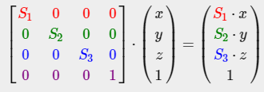

#### 平移

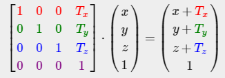

#### 旋转

##### 绕X轴旋转

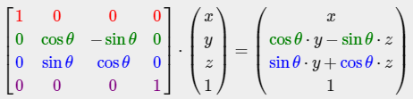

##### 绕y轴旋转

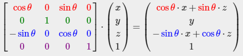

##### 绕z轴旋转

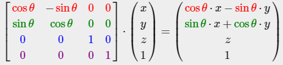

## 显示3D立方体

### 坐标系统

看看要显示一个3D物体是有多么复杂

#### 局部空间(物体空间)

电脑在工厂中制造的时候, 工人需要去考虑这颗螺丝需要装到电脑的什么位置, 这个就是局部空间. 在局部空间中, 物体位于空间的原点, 所有的调整就是基于物体的相对位置去调整的.

#### 世界空间

在OpenGL中, 我们使用模型矩阵讲物体放到世界空间中的某个位置上. 需要分成两个操作:

* 人眼的视线转换到正对-z轴的方向, 并将物体转换到以人眼为原点的位置上.
* 物体必须在人眼的视野之内

这就是观察空间和裁剪空间的概念.

#### 观察空间

观察空间是以摄像机的位置为原点, 观察方向为-z轴方向的一个空间. 我们通常会用一系列的平移和旋转变换来把世界空间中的物体转换到观察空间中. 用来执行这种变换的东西, 我们称为观察矩阵.

#### 裁剪空间

摄像机有朝向, 也有拍摄的视野范围, 所有在视野范围之外的东西都看不到, 都被剔除了.

在每个顶点着色器运行结束的时候, OpenGL希望所有的坐标都在一个指定的范围内, 所有超出范围的坐标都会被裁剪, 被抛弃, 剩下的坐标才会进入片元着色器阶段然后显示到屏幕上.

将物体从观察空间转换到裁剪空间的操作叫做投影变换(perspective projection), 用到的也就是一个投影变换的矩阵而已.

还是从现实世界中看到东西的角度去分析.

人眼在看东西时, 左右宽度上有一定的范围, 上下高度上也有一定的范围. 放到OpenGL中, 就是摄像机的左右和上下方向上都有一定的视野角度(FOV), 只有在这个角度范围内的东西, 才可能被看到.

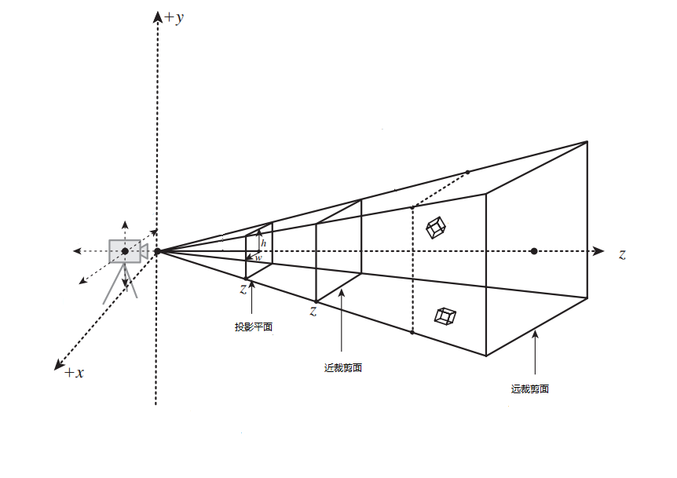

从上面的图中可以看出, h和w就确定了摄像机上下左右可以看到的范围大小. 通常我们会设置上下左右的视野都是90度. 为了方便计算(这点非常重要! 想把所有的物体都渲染出来, 世界上所有的计算机的运算能力加起来都不够, 所有, 不要显示的就坚决剔除.), 我们也会设置一个近裁剪面和一个远裁剪面. 比近才见面更近的物体被剔除, 比远裁剪面更远的物体被剔除. 我们需要把两个裁剪面之间的所有物体都映射到投影平面上(投影平面可以在近裁剪面和远裁剪面之间, 图上只是一种情况), 其他的物体都被剔除!

#### 视口空间

视口空间, 可以简单地理解成应用窗口. 投影平面上的东西和窗口上的像素通过一一对应的方式映射到窗口, 在窗口上显示!

这一步由OpenGL完成, 我们不管.

### 旋转的3D盒子

定义所有顶点的工作非常复杂繁琐, 我这里直接把定义好的36个顶点都列出来(6个面 * 每个面2个三角形 * 每个三角形3个顶点), 每个面顶点都包含了纹理坐标.

```c
float vertices[] = {
    -0.5f, -0.5f, -0.5f, 0.0f, 0.0f,
    0.5f, -0.5f, -0.5f, 1.0f, 0.0f,
    0.5f, 0.5f, -0.5f, 1.0f, 1.0f,
    0.5f, 0.5f, -0.5f, 1.0f, 1.0f,
    -0.5f, 0.5f, -0.5f, 0.0f, 1.0f,
    -0.5f, -0.5f, -0.5f, 0.0f, 0.0f,

    -0.5f, -0.5f, 0.5f, 0.0f, 0.0f,
    0.5f, -0.5f, 0.5f, 1.0f, 0.0f,
    0.5f, 0.5f, 0.5f, 1.0f, 1.0f,
    0.5f, 0.5f, 0.5f, 1.0f, 1.0f,
    -0.5f, 0.5f, 0.5f, 0.0f, 1.0f,
    -0.5f, -0.5f, 0.5f, 0.0f, 0.0f,

    -0.5f, 0.5f, 0.5f, 1.0f, 0.0f,
    -0.5f, 0.5f, -0.5f, 1.0f, 1.0f,
    -0.5f, -0.5f, -0.5f, 0.0f, 1.0f,
    -0.5f, -0.5f, -0.5f, 0.0f, 1.0f,
    -0.5f, -0.5f, 0.5f, 0.0f, 0.0f,
    -0.5f, 0.5f, 0.5f, 1.0f, 0.0f,

    0.5f, 0.5f, 0.5f, 1.0f, 0.0f,
    0.5f, 0.5f, -0.5f, 1.0f, 1.0f,
    0.5f, -0.5f, -0.5f, 0.0f, 1.0f,
    0.5f, -0.5f, -0.5f, 0.0f, 1.0f,
    0.5f, -0.5f, 0.5f, 0.0f, 0.0f,
    0.5f, 0.5f, 0.5f, 1.0f, 0.0f,

    -0.5f, -0.5f, -0.5f, 0.0f, 1.0f,
    0.5f, -0.5f, -0.5f, 1.0f, 1.0f,
    0.5f, -0.5f, 0.5f, 1.0f, 0.0f,
    0.5f, -0.5f, 0.5f, 1.0f, 0.0f,
    -0.5f, -0.5f, 0.5f, 0.0f, 0.0f,
    -0.5f, -0.5f, -0.5f, 0.0f, 1.0f,

    -0.5f, 0.5f, -0.5f, 0.0f, 1.0f,
    0.5f, 0.5f, -0.5f, 1.0f, 1.0f,
    0.5f, 0.5f, 0.5f, 1.0f, 0.0f,
    0.5f, 0.5f, 0.5f, 1.0f, 0.0f,
    -0.5f, 0.5f, 0.5f, 0.0f, 0.0f,
    -0.5f, 0.5f, -0.5f, 0.0f, 1.0f
};
```

修改顶点属性的设置

```c
glVertexAttribPointer(0, 3, GL_FLOAT, GL_FALSE, 5 * sizeof(float), (void *)0);
glEnableVertexAttribArray(0);
glVertexAttribPointer(1, 3, GL_FLOAT, GL_FALSE, 5 * sizeof(float), (void *)(3 * sizeof(float)));
GLES30.glEnableVertexAttribArray(1);
```

修改顶点着色器中的纹理坐标位置

```c
layout (location = 0) in vec3 aPos;
layout (location = 1) in vec2 aTexCoord;
```

显示的方式

```c
glDrawArray(GL_TRIANGLES, 0, 36);
```

接下来就是走一个显示流水线, 局部空间->世界空间->观察空间->裁剪空间->视口空间

定义模型变换矩阵

```c
glm::mat4 model;
model = glm::rotate(model, (float)glfwGetTime() * glm::radians(50.0f), glm::vec3(0.5f, 1.0f, 0.0f));
```

模型会根据运行时间旋转一定的角度, 看起来有动画的效果.

定义观察变换矩阵

```c
glm::mat4 view;
view = glm::translate(view, glm::vec3(0.0f, 0.0f, -4.0f));
```

定义投影变换矩阵

```c
glm::mat4 projection;
projection = glm::perspective(glm::radians(45.0f), (float)SCR_WIDTH / (float)SCR_HEIGHT, 0.1f, 100.0f);
/**
 * 第一个参数: FOV, 角度为45度
 * 第二个参数: 定义了屏幕宽高比(aspect ratio), 这个值影响显示到窗口中的物体是原样显示还是被拉伸
 * 第三个参数: 0.1f是近裁剪面
 * 第四个参数: 100.0f是远裁剪面
**/
```

将这些矩阵应用到顶点着色器中, 顶点着色器需要3个变量来接收这些矩阵.

```glsl
uniform mat4 model;
uniform mat4 view;
uniform mat4 projection;

void main() {
    gl_Position = projection * view * model * vec4(aPos, 1.0f);
    TexCoord = vec2(aTexCoord.x, aTexCoord.y);
}
```

主循环中也要每次给这个三个变量赋值:

```c
shader.setMat4("model", glm::value_ptr(model));
shader.setMat4("view", glm::value_ptr(view));
shader.setMat4("projection", glm::value_ptr(projection));
```

在绘制三角形的时候, 是逐个绘制的. OpenGL没有检测它们在位置上的前后关系, 只是用后来的像素覆盖掉之前的像素而已.

我们需要开启深度检测!

OpenGL内部本就保存了一份顶点的深度信息, 这个信息的名字叫z缓存(z-buffer), 也叫深度缓存. 默认情况下, 深度检测是关闭的, 我们需要在某个位置把它打开. 打开的方法是调用

```c
glEnable(GL_DEPTH_TEST);
```

然后在清楚屏幕的时候, 也需要把深度缓存的数据清除掉

```c
glClear(GL_COLOR_BUFFER_BIT | GL_DEPTH_BUFFER_BIT);
```

如果要绘制10个, 我们不用傻傻地复制36个顶点9次, 只需要把这个盒子移动某个位置, 然后绘制一遍就行了.

定义10个位置:

```c
glm::vec3 cubePositions[] = {
    glm::vec3(0.0f, 0.0f, 0.0f),
    glm::vec3(2.0f, 5.0f, -15.0f),
    glm::vec3(-1.5f, -2.2f, -2.5f),
    glm::vec3(-3.8f, -2.0f, -12.3f),
    glm::vec3( 2.4f, -0.4f, -3.5f),  
    glm::vec3(-1.7f,  3.0f, -7.5f),  
    glm::vec3( 1.3f, -2.0f, -2.5f),  
    glm::vec3( 1.5f,  2.0f, -2.5f), 
    glm::vec3( 1.5f,  0.2f, -1.5f), 
    glm::vec3(-1.3f,  1.0f, -1.5f)
};
```

然后在主循环中绘制10次

```c
glBinderVertexArray(VAO);
for (int i = 0; i < 10; i++) {
    glm::mat4 model;
    model = glm::translate(model, cubePosition[i]);
    float angle = 20.0f * i;
    model = glm::rotate(model, glm::radians(angle), glm::vec3(1.0f, 0.3f, 0.5f));
    shader.setMat4("model", glm::value_ptr(model));
    glDrawArrays(GL_TRIANGLES, 0, 36);
}
```

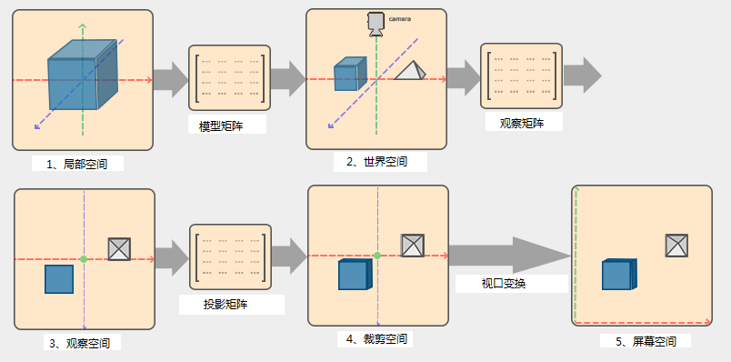

## FPS摄像机

我们要创建一个类似FPS的摄像机, 它可以移动, 可以转头, 可以变焦(Kar 98K, 8倍镜的效果)

主要内容如下

* 观察空间变换的内部原理
* 键盘操纵摄像机前后左右移动的方法
* 鼠标操纵摄像机上下左右转动的方法
* 实现变焦的方式
* 将摄像机功能封装成一个很秀的类

### 观察(摄像机)空间

观察空间其实是以摄像机为原点, 以摄像机观察的方向为-z轴方向的坐标系统. 而观察矩阵的作用, 就是将场景中的物体从世界坐标转换到观察坐标. 要定义一个摄像机系统, 我们需要它在世界空间中的位置, 它的朝向, 以及一个向上方向的向量.

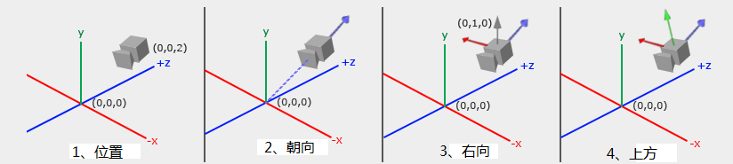

#### 相机位置

相机位置就是一个简单的向量, 表示其在世界空间中的位置.

```c
glm::vec3 cameraPos = glm::vec3(0.0f, 0.0f, 4.0f);
```

OpenGL是右手坐标系, 摄像机是往-z轴方向看的

#### 光线方向

作为朝向的反方向, 我成它为光线方向(物体反射光摄入观察者眼睛的方向). 计算的方式很简单, 将相机位置向量和观察目标点向量做减法就可以了. 我们使用世界坐标原点(默认点)作为我们的观察目标点.

```c
glm::vec3 cameraTarget glm::vec3(0.0f, 0.0f, 0.0f);
glm::vec3 cameraDirection = glm::mormalize(cameraPos - cameraTarget);
```

#### Right轴

我们下一个需要的向量是Right向量, 它表示坐标系统中的x轴正方向. 要计算这个Right向量, 我们要用到一个小技巧: 向量叉乘. Right向量必须要垂直于光线方向, 因此, 它必须要和光线方向与世界坐标系统的y轴组成的平面垂直. 根据叉乘规则, 我们只需要将y轴的单位向量与光线方向向量做叉乘就可以了.

```c
glm::vec3 up = glm::vec3(0.0f, 1.0f, 0.0f);
glm::vec3 cameraRight = glm::normalize(glm::cross(up, cameraDiretion));
```

#### Up轴

现在, 我们有了x轴和z轴, y轴已经呼之欲出了. 只需要用z轴向量叉乘x轴向量就可以了.

```c
glm::vec3 cameraUp = glm::cross(cameraDirection, cameraRight);
```

坐标系统的三个轴都有了, 马上开始生成观察矩阵

#### 观察矩阵

用矩阵的最大好处就是当你有了坐标空间的3个轴之后, 再加上一个位置向量就可以创造一个变换矩阵. 用这个矩阵乘上任何向量都可以将这个向量转换到观察坐标系中
$$
LookAt = 
\begin{vmatrix} 
\mathbf{R}_x & \mathbf{R}_y & \mathbf{R}_z & 0 \\
\mathbf{U}_x & \mathbf{U}_y & \mathbf{U}_z & 0 \\
\mathbf{D}_x & \mathbf{D}_y & \mathbf{D}_z & 0 \\
0 & 0 & 0 & 1 \\
\end{vmatrix}
*
\begin{vmatrix} 
1 & 0 & 0 & -\mathbf{P}_x \\
0 & 1 & 0 & -\mathbf{P}_y \\
0 & 0 & 1 & -\mathbf{P}_z \\
0 & 0 & 0 & 1 \\
\end{vmatrix}
$$
以上就是生成的观察矩阵.

R表示Right向量, U表示Up向量, D表示光线向量, P表示位置向量. 注意, 位置向量取的是它的反方向, 因为物体需要朝着摄像机相反的方向移动才行.

总结一下我们需要用到的数据: 摄像机的位置, 摄像机的观察目标(可以生成光线方向), 还有世界空间的Up向量. 使用这些数据, 通过计算, 我们就可以生成任意的观察矩阵. glm已经帮我们封装好了一个函数, 调用它, 我们可以直接获取到观察矩阵

```c
glm::mat4 view;
view = glm::lookAt(glm::vec3(0.0f, 0.0f, 4.0f),
                  glm::vec3(0.0f, 0.0f, 0.0f),
                  glm::vec3(0.0f, 1.0f, 0.0f));
```

 验证一下函数的效果. 我们把摄像机的位置放在半径为10的圆上, 让它的观察点始终在世界空间原点上, 并且, 摄像机不断地在圆上移动

```c
float radius = 10.0f;
float camX = sin(glfwGetTime()) * radius;
float camZ = cos(glfwGetTime()) * radius;
glm::mat4 view;
view = glm::lookAt(glm::vec3(camX, 0.0f, camZ),
                  glm::vec3(0.0f, 0.0f, 0.0f),
                  glm::vec3(0.0f, 1.0f, 0.0f));
```

### 移动相机

我们手动地控制相机的移动. 第一步, 我们要来创建一个相机系统, 这需要我们在程序开始的时候定义一些关于相机的变量

```c
glm::vec3 cameraPos = glm::vec3(0.0f, 0.0f, 4.0f);
glm::vec3 cameraFront = glm::vec3(0.0f, 0.0f, -1.0f);
glm::vec3 cameraUp = glm::vec3(0.0f, 1.0f, 0.0f);
```

观察矩阵就会变成这个样子:

```c
view = glm::lookAt(cameraPos, cameraPos + cameraFront, cameraUp);
```

我们希望摄像机的朝向不变而不是观察目标不变, 所以观察点就变成cameraPos + cameraFront. 现在观察点就变成cameraPos + cameraFront. 现在, 我们就要用键盘操作移动.

```c
float cameraSpeed = 0.05f; // 移动速度
if (glfwGetKey(window, GLFW_KEY_W) == GLFW_PRESS)
    cameraPos += cameraSpeed * cameraFront;

if (glfwGetKey(window, GLFW_KEY_S) == GLFW_PRESS)
    cameraPos -= cameraSpeed * cameraFront;

if (glfwGetKey(window, GLFW_KEY_A) == GLFW_PRESS)
    cameraPos -= glm::normalize(glm::cross(cameraFront, cameraUp) * cameraSpeed);

if (glfwGetKey(window, GLFW_KEY_D) == GLFW_PRESS)
    cameraPos += glm::normalize(glm::cross(cameraFront, cameraUp) * cameraSpeed);
```

这样就可以用WASD键来控制前后左右的移动了


这段代码纯粹是基于按键和代码运行速度来控制的, 如果机子不好, 代码运行慢点移动的速度也会变慢, 这就不太科学了. 因此, 我们引入时间来计算移动的距离.

先定义两个全局的变量, 用来保存上一帧绘制的时间以及两帧之间的间隔时间

```c
float deltaTime = 0.0f; // 两帧之间的间隔时间
float lastFrame = 0.0f; // 上一帧绘制的时间
```

然后, 每一帧都更新这两个数值

```c
float currentFrame = glfwGetTime();
deltaTime = currentFrame - lastFrame;
lastFrame = currenFrame;
```

最后, 使用这个数值

```c
float cameraSpeed = 2.5f * deltaTime; // 移动速度
```

但是, 左右方向上移动很快, 前后方向就很慢.

### 环顾四周

只用WASD的控制移动还不算一个完整的FPS摄像机, 我们还要能转头才行.

要实现转头的功能, 我们就要对cameraFront向量进行改变了. 不过对方向向量的改变比较复杂, 还涉及一些三角学的知识.

#### 欧拉角

欧拉角是绕着三条轴旋转的一个值. 一共有3种欧拉角, 分别是pitch, yaw和roll.

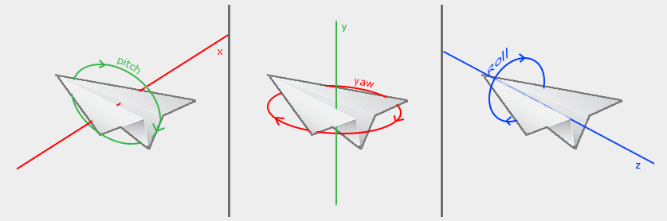

pitch表示我们平时抬头低头的动作, yaw表示左看右看, roll表示打滚的效果. 每个欧拉角组合起来之后, 我们可以表示任何旋转.

作为一个FPS摄像机, 我们只需要pitch和yaw两种旋转就行了. 通过三角计算, 将方向向量设置成新值.

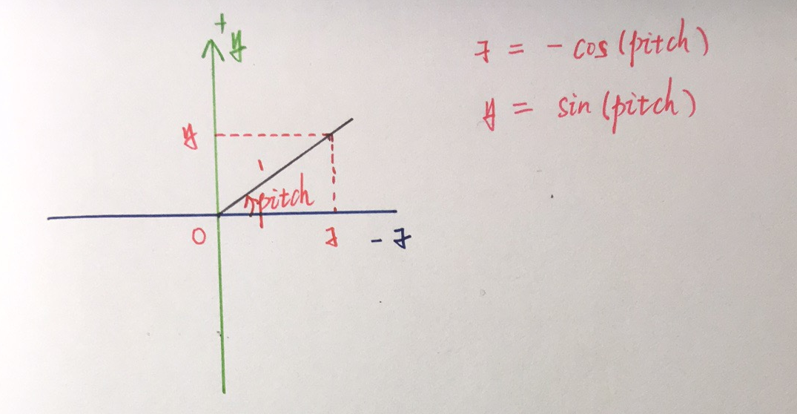

上图就是pitch旋转的计算方法, 我们的初始方向为(0, 0, -1). 当我们想要转动pitch角度时, z坐标就等于-cos(pitch), y坐标就等于sin(pitch), 因为我们假定了斜边长度为1, 只考虑其方向.

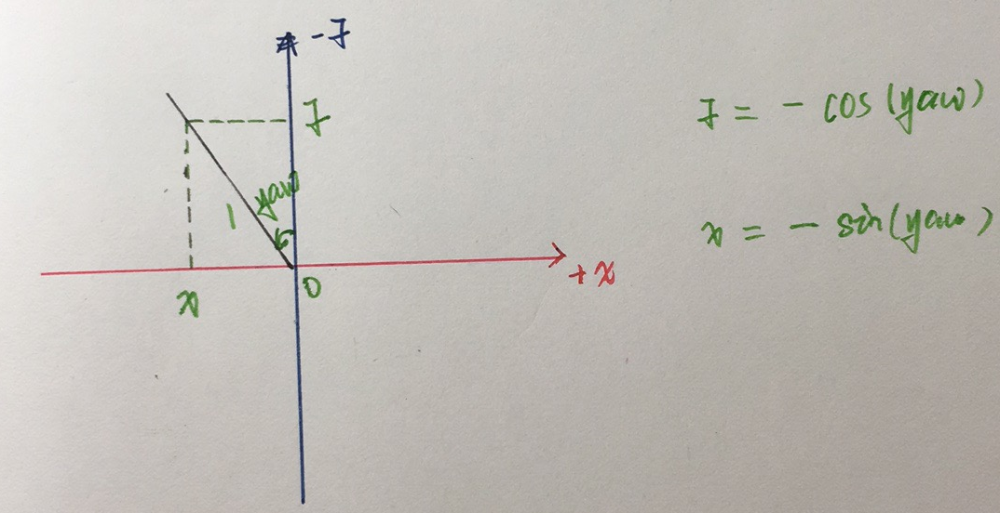

类似的, 计算yaw的方法也是如此, z坐标等于-cos(yaw),  x坐标等于-sin(yaw)

将两个旋转整合起来:

x = -sin(yaw)

y = sin(pitch)

z = -cos(pitch) * cos(yaw) 

负号只是代表了方向

#### 鼠标输入

pitch和yaw的值是通过鼠标的移动得到的, 水平方向上的移动代表了yaw的值, 垂直方向上的移动代表了pitch的值. 我们需要保存上一次鼠标的位置, 这样可以通过计算和这次鼠标位置的差值算出转动的角度. 不过首先, 我们需要把鼠标的光标隐藏起来, 并且捕获鼠标消息

```c
glfwSetInputMode(window, GLFW_CURSOR, GLFW_CURSOR_DISABLED);
glfwSetCursorPosCallback(window, mouse_callback);
```

mouse_callback是响应鼠标消息的回调函数, 原型如下

```c
void mouse_callback(GLFWwindow *window, double xpos, double ypos);
```

window表示捕获的窗口, xpos表示x坐标, ypos表示y坐标

为了计算一个方向向量, 我们需要做这么几件事:

* 计算鼠标相对于上一次的位置偏移
* 将偏移值累加到摄像机的yaw和pitch值中去
* 添加一些旋转的限制
* 计算方向向量

```c
if (firstMouse) {  //设置初始位置，防止突然跳到某个方向上
    lastX = xPos;
    lastY = yPos;
    firstMouse = false;
}

float xoffset = lastX - xPos;   //别忘了，在窗口中，左边的坐标小于右边的坐标，而我们需要一个正的角度
float yoffset = lastY - yPos;   //同样，在窗口中，下面的坐标大于上面的坐标，而我们往上抬头的时候需要一个正的角度
lastX = xPos;
lastY = yPos;

float sensitivity = 0.05f;  //旋转精度
xoffset *= sensitivity;
yoffset *= sensitivity;

yaw += xoffset;
pitch += yoffset;

if (pitch > 89.0f)  //往上看不能超过90度
    pitch = 89.0f;
if (pitch < -89.0f)  //往下看也不能超过90度
    pitch = -89.0f;

glm::vec3 front;
front.x = -sin(glm::radians(yaw)) * cos(glm::radians(pitch));
front.y = sin(glm::radians(pitch));
front.z = -cos(glm::radians(pitch)) * cos(glm::radians(yaw));
cameraFront = glm::normalize(front);
```

为了防止突然跳到某个方向, 我们在鼠标刚开始的时候对它的位置进行设置. 接下来, 计算与上次位置的偏移量, 然后乘上旋转精度得到旋转的角度值. 然后, 将旋转角度累加到pitch和yaw值中去. 并且, 设置pitch的最大和最小值, 最后, 根据我们上面推导的公式, 计算方向向量, 并将其规范化.

#### 变焦

变焦功能, 就是狙击枪的放大镜头. 通过改变视野值来达到效果, 将fov值变小, 我们就能看到远方更精细的画面, 将fov值变大, 我们就可以看到更广的画面, 当然也失去了精度优势.

那么我们如何获得fov的改变值呢? 可以通过鼠标滚轮消息来模拟.

```c
//鼠标滚轮消息回调
void scroll_callback(GLFWwindow* window, double xoffset, double yoffset) {
    if (fov >= 1.0 && fov <= 45.0)
        fov -= yoffset;
    if (fov <= 1.0)
        fov = 1.0;
    if (fov >= 45.0)
        fov = 45.0;
}
```

当滚轮往前的时候, yoffset为正, 使得fov值变大, 物体变大变精细. 相反, 当滚轮往后的时候, yoffset为负, 使fov值变大, 物体变小视野变广.

修改投影矩阵

```c
projection = glm::perspective(glm::radians((float)fov), (float)SCR_WIDTH / (float)SCR_HEIGHT, 0.1f, 100.0f);
```

### 万向节死锁

使用四元数的方法, 解决这个问题

## 基本光照模拟

如何用OpenGL模拟基本光照, 涉及如下几个概念:

* 颜色的原理
* 环境光原理
* 漫反射光原理
* 镜面高光原理
* 显示一个包含所有这些光的场景

### 颜色

在OpenGL中, 我们用一个红色, 绿色和蓝色的分量组成一个RGB格式的向量来表示颜色. 举个例子, 一个珊瑚红色的颜色向量是这样的:

```c
glm::vec3 coral(1.0f, 0.5f, 0.31f);
```

事实上, 物体本身并没有颜色. 我们看到的颜色是物体表面对光照的反射属性不同, 反射出来的不同的光的颜色.

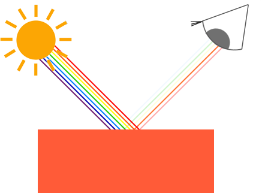

可以看到, 物体反射出来的红色最多, 将其他的颜色掩盖之后, 我们看到的就是一个红色的物体, 未被反射出来的光都被物体吸收了.

那么如何在OpenGL中模拟这种情况呢? 其实我们已经定义好了. 在上面定义的coral变量中, 我们指明了红色会完全反射(1.0f), 绿色会反射一半(0.5f), 而蓝色会反射31%(0.31f). 当有一束白色的光(1.0f, 1.0f, 1.0f)照射到coral上时, 将两个向量相乘, 所得到的向量就是最终物体上的颜色向量.

```c
glm::vec3 lightColor(1.0f, 1.0f, 1.0f);
glm::vec3 toyColor(1.0f, 0.5f, 0.31f);
glm::vec3 result = lightColor * toyColor; // = (1.0f, 0.5f, 0.31f)
```

### 实现一个有光照的场景

我们会通过模拟现实生活中的光照实现一些非常有趣的效果. 所以, 撇开之前的纹理, 我们重新来弄一个见到的场景, 再往里边面添加光照效果.

我们首先要做的就是创建一个可以接受光照的物体, 方便起见, 还是用一个立方体盒子, 我们还需要一个东西来模拟光源, 东西越简单越好, 最好还是一个立方体盒子.

填充VBO, 设置顶点属性等等的工作.

新的立方体上, 我们只需要位置属性, 去除之前的纹理, 在顶点着色器中对顶点进行转换就可以了.

```glsl
// 顶点着色器
#version 330 core

layout (location = 0) in vec3 aPos;

uniform mat4 model;
uniform mat4 view;
uniform mat4 projection;

void main() {
    gl_Position = projection * view * model * vec4(aPos, 1.0f);
}
```

确保已经更新了顶点属性的配置, 只有位置属性的顶点跨度为3 * sizeof(float)

```c
// 顶点属性环境
unsigned int VBO, VAO;

glGenVertexArrays(1, &VAO);
glBindVertexArray(VAO);

glGenBuffers(1, &VBO);
glBindBuffer(GL_ARRAY_BUFFER, VBO);
glBufferData(GL_ARRAY_BUFFER, sizeof(vertices), vertices, GL_STATIC_DRAW);

// 顶点属性设置
glVertexAttribPointer(0, 3, GL_FLOAT, GL_FALSE, 3 * sizeof(float), (void *)0);
glEnableVertexAttribArray(0);
```

定义完立方体之后, 再来弄一个片元着色器

```glsl
#version 330 core

out vec4 FragColor;

uniform vec3 objectColor;
uniform vec3 lightColor;

void main() {
    FragColor = vec4(lightColor * objectColor, 1.0);
}
```

片元着色器需要物体颜色和光照颜色两个uniform变量来计算. 这里我们根据之前的理解, 直接将两个变量相乘, 再添加一个齐次分量后赋值给片元颜色. 我们来设置物体颜色和光照颜色.

```c
lightingShader.use();
lightingShader.setVec3("objectColor", 1.0f, 0.5f, 0.31f);
lightingShader.setVec3("lightColor", 1.0f, 1.0f, 1.0f);
```

当我们改变着色器的时候, 我们不仅希望物体的颜色变化, 而希望连光源的颜色都变了, 所以, 这里我们还要多定义一个片元着色器用于对光源进行渲染

```glsl
#version 330 core

out vec4 FragColor;

void main() {
    FragColor = vec4(1.0);
}
```

很简单, 只需要讲光源设置成白色就行. 当我们绘制盒子立方体时, 我们使用前面的那个着色器, 当我们绘制光源立方体时, 我们使用这个着色器

定义一个光源的位置, 然后将光源立方体移动到指定位置

```c
glm::vec3 lightPos(1.2f, 1.0f, 2.0f);
...
model = glm::mat4();
model = glm::translate(model, lightPos);
model = glm::scale(model, glm::vec3(0.2f));
```

在渲染的时候, 对盒子立方体, 要用lightShader, 对光源立方体, 要用lampShader.

### 基础光照

现实世界中的光照受太多因素的影响, 以至于我们根本就没有足够的计算力来计算其所有的因素. OpenGL中使用一些简单的模型来模拟真实世界中的光照, 将这些模型组合起来后, 我们也能得到非常逼真的效果. 有一种模型叫做: 冯氏光照模式(Phong light model). 这种模型有三种光照组成: 环境光(ambient), 漫反射光(diffuse) 和镜面高光(specular). Phong光照模型是图形学中最常用的模型, 用了之后效果也非常赞. 来看一组效果图:

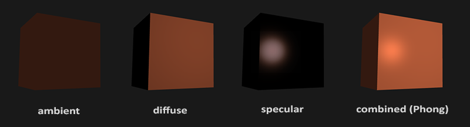

* 环境光(Ambient): 即便是在漆黑的夜晚也还是有少许亮光的存在(月亮, 远处的灯光, 星光), 所以, 物体不会是完全的黑色. 为了模拟这种情况, 我们通常会给定一个常量颜色值充当环境光
* 漫反射光(diffuse): 模拟光直接照射到物体上的情况. 这时光照模型中最具有特点的组成部分. 越朝向光源的部分看起来就越亮
* 镜面高光(specular): 模拟一个非常光滑的物体上的聚光灯效果. 镜面高光受光照颜色的影响比受物体颜色的影响更大

想要让场景中的效果逼真, 我们至少需要模拟这三种光照. 先从最简单的开始: 环境光(Ambient)

#### 环境光(Ambient)

光照通常不会来自一个单一的光源, 而是在场景中各个光源, 各种反射或折射综合而成的一个效果. 将这些因素都考虑进去的算法称作全局光照算法, 但是这些算法非常难懂而且运行起来代价高昂.

于是, 我们自然而然地寻找一些简单的方法来替代这些高昂的算法, 终于, 我们找到了环境光这种模型. 就如之前所说, 我们使用一个小常量颜色来代替照射到物体的环境光.

使用环境光非常的简单, 我们只需要设置一个环境光强度, 用这个强度值乘上光源的颜色得到环境光颜色. 最后, 用环境光颜色乘上物体的颜色, 得到物体在光照下的最终颜色值, 使用环境光的代码如下:

```glsl
void main() {
    float ambientStrength = 0.1;
    vec3 ambient = ambientStrength * lightColor;
    vec3 result = ambient * objectColor;
    FragColor = vec4(result, 1.0f);
}
```

#### 漫反射光(Diffuse)

相对于环境光(ambient)来说, 漫反射光(Diffuse)在物体上的表现更明显, 也给了物体最直观的特征. 为了能更好的理解漫反射, 请看下面的一张图:

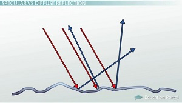

我们的物体表面并不会那么光滑平整, 光线照射到物体表面的时候会产生方向不同的反射效果, 这些反射就是漫反射. 漫反射光(Diffuse)期望模拟的, 就是这种光线照射上来之后, 经过物体复杂的漫反射之后所呈现出的整体的光照效果.

那么, 我们如何计算漫反射呢?

* 法向量(Normal Vector): 垂直于顶点表面的一个向量
* 光线向量: 片元位置和光源之间的一个方向向量, 用于计算与法向量之间的夹角
* 计算光线向量和法向量之间的夹角, 如果夹角<90度, 说明物体是对着光源的, 再根据cos值来计算强度. 如果夹角>90度, 说明物体背对光源, 光照也就没效果了

##### 法向量(Normal Vector)

法向量是垂直于顶点表面的单位向量. 因为顶点本身是没有表面这个概念的, 所以我们会参考周围的顶点来确定它的表面, 从而计算出法向量. 在计算法向量的时候, 我们用了一些小技巧(叉乘). 因为3D立方体并不复杂, 所以我们手动计算了所有顶点的法向量. 完整的顶点结构如下:

```c
float vertices[] = {
    // X       Y      Z    Nx    Ny     Nz
    -0.5f, -0.5f, -0.5f, 0.0f, 0.0f, -1.0f,
    0.5f, -0.5f, -0.5f, 0.0f, 0.0f, -1.0f,
    0.5f, 0.5f, -0.5f, 0.0f, 0.0f, -1.0f,
    0.5f, 0.5f, -0.5f, 0.0f, 0.0f, -1.0f,
    -0.5f, 0.5f, -0.5f, 0.0f, 0.0f, -1.0f,
    -0.5f, -0.5f, -0.5f, 0.0f, 0.0f, -1.0f,

    -0.5f, -0.5f, 0.5f, 0.0f, 0.0f, 1.0f,
    0.5f, -0.5f, 0.5f, 0.0f, 0.0f, 1.0f,
    0.5f, 0.5f, 0.5f, 0.0f, 0.0f, 1.0f,
    0.5f, 0.5f, 0.5f, 0.0f, 0.0f, 1.0f,
    -0.5f, 0.5f, 0.5f, 0.0f, 0.0f, 1.0f,
    -0.5f, -0.5f, 0.5f, 0.0f, 0.0f, 1.0f,

    -0.5f, 0.5f, 0.5f, -1.0f, 0.0f, 0.0f,
    -0.5f, 0.5f, -0.5f, -1.0f, 0.0f, 0.0f,
    -0.5f, -0.5f, -0.5f, -1.0f, 0.0f, 0.0f,
    -0.5f, -0.5f, -0.5f, -1.0f, 0.0f, 0.0f,
    -0.5f, -0.5f, 0.5f, -1.0f, 0.0f, 0.0f,
    -0.5f, 0.5f, 0.5f, -1.0f, 0.0f, 0.0f,

    0.5f, 0.5f, 0.5f, 1.0f, 0.0f, 0.0f,
    0.5f, 0.5f, -0.5f, 1.0f, 0.0f, 0.0f,
    0.5f, -0.5f, -0.5f, 1.0f, 0.0f, 0.0f,
    0.5f, -0.5f, -0.5f, 1.0f, 0.0f, 0.0f,
    0.5f, -0.5f, 0.5f, 1.0f, 0.0f, 0.0f,
    0.5f, 0.5f, 0.5f, 1.0f, 0.0f, 0.0f,

    -0.5f, -0.5f, -0.5f, 0.0f, -1.0f, 0.0f,
    0.5f, -0.5f, -0.5f, 0.0f, -1.0f, 0.0f,
    0.5f, -0.5f, 0.5f, 0.0f, -1.0f, 0.0f,
    0.5f, -0.5f, 0.5f, 0.0f, -1.0f, 0.0f,
    -0.5f, -0.5f, 0.5f, 0.0f, -1.0f, 0.0f,
    -0.5f, -0.5f, -0.5f, 0.0f, -1.0f, 0.0f,

    -0.5f, 0.5f, -0.5f, 0.0f, 1.0f, 0.0f,
    0.5f, 0.5f, -0.5f, 0.0f, 1.0f, 0.0f,
    0.5f, 0.5f, 0.5f, 0.0f, 1.0f, 0.0f,
    0.5f, 0.5f, 0.5f, 0.0f, 1.0f, 0.0f,
    -0.5f, 0.5f, 0.5f, 0.0f, 1.0f, 0.0f,
    -0.5f, 0.5f, -0.5f, 0.0f, 1.0f, 0.0f
};
```

当我们加入了额外的顶点属性之后, 条件反射式的就要去修改传递给OpenGL的信息. 请注意, 两个立方体虽然公用一组数据, 但是物体需要法线信息, 而光源不需要法线信息. 因此, 一个重要的操作就是把渲染物体的VAO和渲染光源的VAO分开, 各自设置自己的顶点属性: 物体需要全部的顶点属性, 光源只需要位置的属性

```c
// VBO, 物体VAO
unsigned int VBO, cubeVAO;
glGenVertexArrays(1, &cubeVAO);
glGenBuffers(1, &VBO);

glBindBuffer(GL_ARRAY_BUFFER, VBO);
glBufferData(GL_ARRAY_BUFFER, sizeof(vertices), vertices, GL_STATIC_DRAW);

glBindVertexArray(cubeVAO);

// 位置属性
glVertexAttribPointer(0, 3, GL_FLOAT, GL_FALSE, 6 * sizeof(float), (void *)0);
glEnableVertexAttribArray(0);
// 法向量属性
glVertexAttribPointer(1, 3, GL_FLOAT, GL_FALSE, 6 * sizeof(float), (void *)0);
glEnableVertexAttribArray(1);

// 光源VAO (VBO相同, 因为顶点数据是同一组)
unsigned int ligthVAO;
glGenVertexArrays(1, &lightVAO);
glBindVertexArray(lightVAO);

glBindBuffer(GL_ARRAY_BUFFER, VBO);
// 位置属性(只需要更新跨度就可以了)
glVertexAttribPointer(0, 3, GL_FLOAT, GL_FALSE, 6 * sizeof(float), (void *)0);
glEnableVertexAttribArray(0);
```

接着光照顶点着色器中要接受法向量进行操作, 然后输出法向量, 片元着色器中也要接受法向量进行计算

```c
// 顶点着色器
...
layout (location = 1) in vec3 aNormal;
...
out vec3 Normal;
...
void main() {
    gl_Position = projection * view * model * vec4(aPos, 1.0f);
    Normal = aNormal;
}
```

```glsl
// 片元着色器
...
in vec3 Normal;
...
```

##### 计算漫反射颜色

现在我们的顶点有了法向量, 还却光源位置和片元位置. 光源位置是一个静态的变量我们直接在片元着色器中定义成uniform变量

```glsl
// 片元着色器
uniform vec3 lightPos;
```

而后, 在主函数中设置光源位置

```c
lightingShader.setVec3("lightPos", lightPos);
```

最后, 我们还要计算出片元的位置. 要计算片元位置, 我们只要将位置与模型矩阵相乘就可以了

```glsl
out vec3 FragPos;
out vec3 Normal;

void main() {
    gl_Position = projection * view * model * vec4(aPos, 1.0f);
    FragPos = vec3(model * vec4(aPos, 1.0));
    Normal = aNormal;
}
```

也别忘了在片元着色器中加上接受片元位置的变量.

```glsl
in vec3 FragPos;
```

紧接着, 我们来计算漫反射颜色. 思路是:

* 计算片元指向光源的向量(光源向量)
* 规范化光源向量和法线向量
* 计算光源向量和法线向量的点积, 将该值乘上光源颜色值

```glsl
// 计算光源向量, 规范化两个向量
vec3 norm = normalize(Normal);
vec3 lightDir = normalize(lightPos - FragPos);
// 计算点积, 修正点积值, 乘上光源颜色值
float diff = max(dot(norm, lightDir), 0.0); //负数没有意义
vec3 diffuse = diff * lightColor;
```

最后的最后, 将环境光(ambient)和漫反射(diffuse)相加起来, 再乘上物体颜色, 得到最终的结果

##### 还有一件事

前面的代码中, 我们直接将法向量从顶点着色器传递到了片元着色器. 不过, 我们在计算的时候, 用的都是世界空间中的坐标, 难道我们不该把法向量也转换成世界空间中的坐标吗? 原则上, 是的, 不过转换操作并不是乘上一个模型矩阵那么简单.

首先, 法向量只有方向有意义(因为我们不需要它在空间中的位置信息). 所以, 我们只对法向量的比例变化和旋转变换感兴趣. 要去除模型矩阵中的平移操作的话, 需要将法向量的齐次坐标(w) 设置为0

然后, 如果模型矩阵进行了一个不规则的比例变换, 那么即使法向量乘上模型矩阵, 法向量也不会和表面垂直了. 如下图所示:

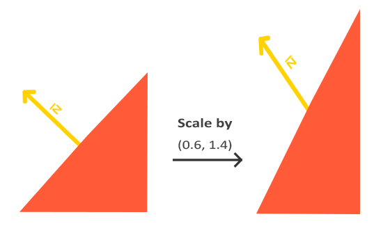

法向量不和表面垂直会严重扭曲光照效果.

解决这个问题的方法是为法向量量身定制一个模型矩阵, 这个矩阵被称为向量矩阵(normal matrix), 其使用了一些线性代数的操作来消除对法向量的比例变换影响

详细的原理超出了本文的讨论范围, 下面直接给出计算的方法:

```glsl
Normal = mat3(transpose(inverse(model)) * aNormal);
```

模型矩阵的逆矩阵的转置矩阵, 就是这货.


前面我们没对法向量转换却没出问题纯粹是侥幸, 因为我们没有对模型进行任何比例变换或者是旋转的操作. 但是, 一旦有这两种操作, 就必须对法向量进行变换.

#### 镜面高光(Specular)

和漫反射很类似, 镜面高光液是基于光源方向向量和物体表面法向量的. 不同的是, 镜面高光也取决于观察者看物体的角度. 想象一下, 如果物体想镜子一样光滑, 我们就能在某个位置看到非常强烈的光照. 原理如下图所示:

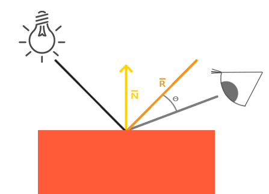

将光源方向沿着法向量对称一下,  我们就得到了反射光向量. 然后, 计算出反射光向量和观察者方向的角度差, 角度差越小, 光照越强.


观察者方向是一个额外我们需要计算的东西, 可以通过观察者位置(世界空间)和片元位置计算出来. 然后, 计算出镜面反射强度, 乘以光照颜色, 将它与环境光和漫反射光加起来, 得到的就是完整的光照效果.


在片元着色器中添加观察者位置变量, 然后在主循环中设置

```glsl
uniform vec3 viewPos;
```

```c
lightingShader.setVec3("viewPos", camera.Position);
```

设置一个镜面反射强度, 控制镜面反射光对物体的影响程度

```glsl
float specularStrength = 0.5;
```

计算反射光向量

```glsl
vec3 viewDir = normalize(viewPos - FragPos);
vec3 reflectDir = reflect(-lightDir, norm);
```

最后, 计算镜面高光的强度, 用下面的公式:

```glsl
float spec = pow(max(dot(viewDir, reflectDir), 0.0), 32);
vec3 specular = specularStrength * spec * lightColor;
```

我们先计算了观察方向和反射方向的夹角(并确保其大于0), 然后计算了它的32次方值. 这个32表示了高光的光泽度信息. 光泽度越高, 高光范围越集中. 如下图所示:

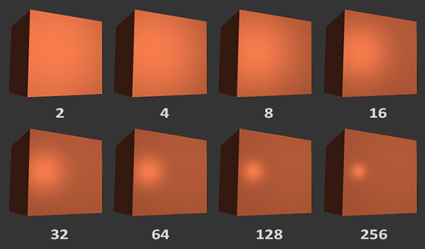

通常, 光泽度设置成32就可以了. 最后, 把镜面高光的部分添加到总的结果里边去. 我们就完成了冯氏光照模型.

## 材质控制光照效果

如何使用材质控制光照效果? 真实世界里, 每个物体对光的反射属性都不同. 铁轮子永远都比木轮子要闪亮. 物体对于镜面高光的反应也不同. 有些物体没有太多散射, 就呈现出一个集中的亮斑; 有些物体的散射多, 就不会有那么小那么亮的亮斑了. 如何描述物体的这些特性, 我们就需要一个新的概念, 那就是: 材质.

### 材质

前面, 我们指定了物体和光源的颜色, 用环境光强度和散射光强度来做物体的反射属性. 使用材质属性的时候, 我们依旧需要指定描述环境光, 漫反射光和镜面高光的分量. 除此之外, 我们还需要一个光泽度(shininess)参数用来表示镜面高光的发散范围.

我们的材质结构也就成型了:

```glsl
#version 330 core
struct Material {
    vec3 ambient;
    vec3 diffuse;
    vec3 specular;
    float shininess;
}

uniform Material material;
```

在片元着色器中, 我们创建了一个材质结构来保存物体的材质属性. 有了这四个分量之后, 我们就能模拟一些真实世界中德物体了.

要得到物体的精确材质是一件非常费时又费力的事情, 而用一个不正确的材质毁掉物体本来该有的视觉效果确实非常容易的事.

让我们在着色器中来实现这样一个材质系统.

### 使用材质

既然我们已经在片元着色器中创建了一个材质结构, 接下来要做的就是使用材质属性来计算光照效果. GLSL中引用结构体中的成员和C语言中一样, 采用material.ambient的形式就可以:

```glsl
void main() {
    // 环境光
    vec3 ambient = lightColor * material.ambient;
    
    // 漫反射光
    vec3 norm = normalize(Normal);
    vec3 lightDir = normalize(LightPos - FragPos);
    
    float diff = max(dot(norm, lightDir), 0.0);
    vec3 diffuse = lightColor * (diff * material.diffuse);
    
    // 镜面高光
    vec3 viewDir = normalize(-FragPos);
    vec3 reflectDir = reflect(-lightDir, norm);
    float spec = pow(max(dot(viewDir, reflectDir), 0.0), material.shiniess);
    vec3 specular = lightColor * (spec * material.specular);
    
    vec3 result = ambient + diffuse + specular;
    FragColor = vec4(result, 1.0f);
}
```

就如代码中写的那样, 我们用材质的属性乘上光照颜色作为光照的效果. 要设置材质的属性, 只能设置材质结构中德某个属性, 而不能直接设置整个材质结构. 所以, 设置的代码就只能是下面这个样子:

```c
lightingShader.setVec3("material.ambient", 1.0f, 0.5f, 0.31f);
lightingShader.setVec3("material.diffuse", 1.0f, 0.5f, 0.31f);
lightingShader.setVec3("material.specular", 0.5f, 0.5f, 0.5f);
lightingShader.setFloat("material.shininess", 32.0f);
```

效果有点奇怪

### 光照属性

我们发现material.ambient数值并不是0.1这样小的数值, 而是几乎把所有光都反射回去了. 从另一个角度来讲, 一个光源对环境光, 漫反射光和镜面高光的贡献应该也是不同的. 对环境光的贡献应该很小, 漫反射应该次之, 镜面高光最大. 所以, 这次我们不改material.ambient的数值, 而是为光源也设置光源属性.

```glsl
struct Light {
    vec3 ambient;
    vec3 diffuse;
    vec3 specular;
};
uniform Light light;
```

添加了光源的属性之后, 我们也需要更新一下光照计算的代码.

```glsl
vec3 ambient = lightColor * material.ambient * light.ambient;
vec3 diffuse = lightColor * (diff * material.diffuse) * light.diffuse;
vec3 specular = lightColor * (spec * material.specular) * light.specular;
```

然后, 在主函数中设置光照属性:

```c
lightingShader.setVec3("light.ambient", 0.2f, 0.2f, 0.2f);
lightingShader.setVec3("light.diffuse", 0.5f, 0.5f, 0.5f);
lightingShader.setVec3("light.specular", 1.0f, 1.0f, 1.0f);
```

现在的效果就好了很多.

### 实现一个绿宝石的颜色

正如之前所说的, 要得到一个正确的材质并不容易, 我们可以一个个数据区试验, 但这太浪费时间了. 下面一张表是有人整理出来的, 我们照方抓药就行.

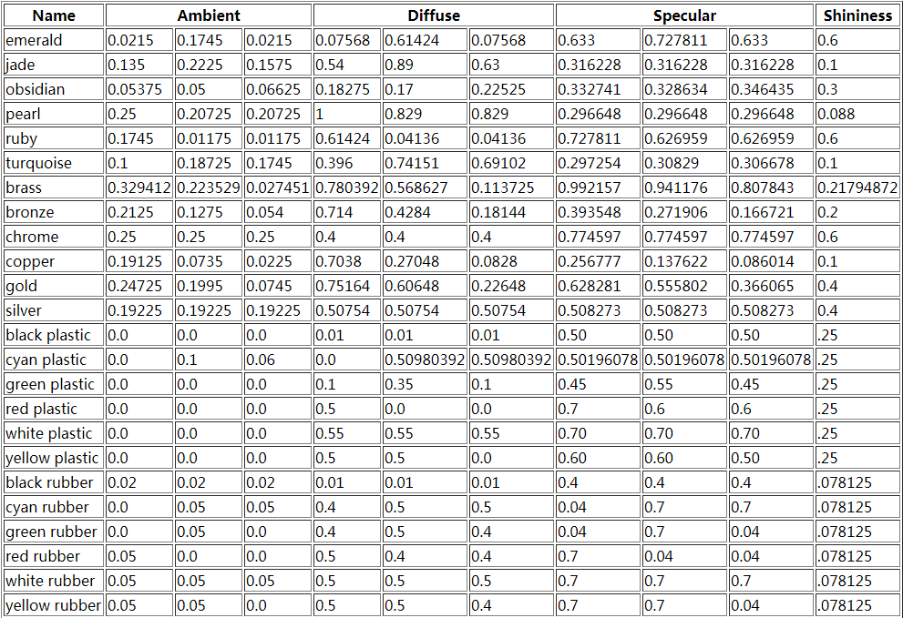

```c
lightingShader.setVec3("material.ambient", 0.0215f, 0.1745f, 0.0215f);
lightingShader.setVec3("material.diffuse", 0.07568f, 0.61424f, 0.07568f);
lightingShader.setVec3("material.specual", 0.633f, 0.727811f, 0.633f);
lightingShader.setFloat("material.shininess", 128 * 0.6f);
lightingShader.setVec3("light.ambient", 1.0f, 1.0f, 1.0f);
lightingShader.setVec3("light.diffuse", 1.0f, 1.0f, 1.0f);
lightingShader.setVec3("light.specular", 1.0f, 1.0f, 1.0f);
```

 能看到绿宝石的粗糙版本了

http://devernay.free.fr/cours/opengl/materials.html

## 光照贴图

使用光照贴图可以给材质添加更多的灵活性

前面我们为整个物体定义了一个整体的材质, 但是现实世界中的对象通常不只一种材质, 而是有多种材质组成. 想象一辆汽车: 车框架是钢制的, 还喷了漆, 看上去闪亮闪亮的, 窗户的部分能照出周围的景物, 轮胎是橡胶不那么闪, 里边的骨架是钢就亮很多. 由此可见, 物体有很大可能是由不同材质组成的一个整体. 难道我们还对物体的每个部分都设置一个材质吗?

当然不是, 我们有光照贴图! 严格来说, 有三种光照贴图: 环境光贴图, 漫反射贴图, 镜面高光贴图. 但是环境光和漫反射光的颜色相似, 知识稍微暗淡点, 所以我们可以把漫反射光的贴图用到环境光上. 剩下的就只有两种贴图了: 漫反射光贴图和镜面高光贴图.

### 漫反射光贴图

在纹理章节里, 我们直接把片元的颜色设置成从纹理中采样的颜色值, 而在这章中, 我们会对采样后的颜色值再进行一系列的计算, 这就是光照贴图(不管是漫反射还是镜面高光)的原理.

由于是对漫反射颜色产生影响, 所以我们称之为漫反射光贴图. 但是, 使用的方法还是类似的. 本次我们使用下面的图来进行操作:

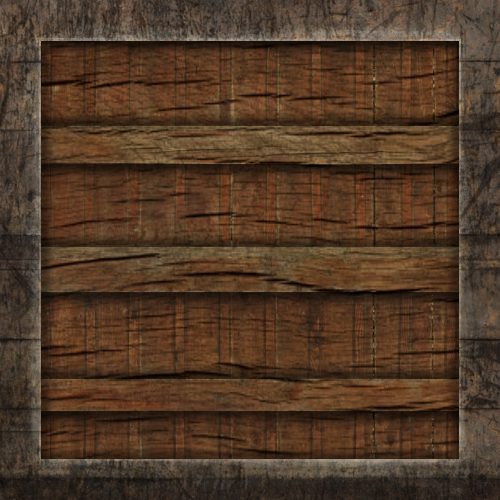

这是一个带金属边的木盒子.

要使用这张图, 我们需要把材质结构中的环境光和漫反射属性去掉, 替换成2D纹理图.

```glsl
struct Material {
    sampler2D diffuse;
    vec3 specular;
    float shininess;
};
...
in vec2 TexCoords;
```

sampler2D是OpengGL中的隐含类型, 我们不能去设置它, 只能将它暴露出来让OpenGL自己去设置. 如果你强行设置, OpenGL会爆出一大堆乱七八糟的Error.

改了材质结构之后, 引用的方式自然也得改, 从单纯的一个变量引用, 现在需要对纹理进行采样了.

```glsl
vec3 ambient = light.ambient * vec3(texture(material.diffuse, TexCoords));
vec3 diffuse = light.diffuse * (diff * vec3(texture(material.diffuse, TexCoords)));
```

环境光也用一样的纹理(如果你非得要用别的纹理, 也没什么问题, 用同样的方法搞一张就行了), 替换掉material.diffuse和material.ambient之后, 就是这样了.

当然, 如果你现在就编译运行, 是绝对看不到什么效果滴, 为啥? 因为我们还没有把纹理坐标传递给片元着色器啊. 使用纹理当然要为顶点指定纹理坐标, 然后将纹理坐标传递给顶点着色器, 让顶点着色器将纹理坐标传递给片元着色器. 顶点属性已经准备好了, 就是这样:

```c
float vertices[] = {
    // 位置                // 法线              // 纹理坐标
    -0.5f, -0.5f, -0.5f,  0.0f,  0.0f, -1.0f,  0.0f, 0.0f,
     0.5f, -0.5f, -0.5f,  0.0f,  0.0f, -1.0f,  1.0f, 0.0f,
     0.5f,  0.5f, -0.5f,  0.0f,  0.0f, -1.0f,  1.0f, 1.0f,
     0.5f,  0.5f, -0.5f,  0.0f,  0.0f, -1.0f,  1.0f, 1.0f,
    -0.5f,  0.5f, -0.5f,  0.0f,  0.0f, -1.0f,  0.0f, 1.0f,
    -0.5f, -0.5f, -0.5f,  0.0f,  0.0f, -1.0f,  0.0f, 0.0f,

    -0.5f, -0.5f,  0.5f,  0.0f,  0.0f, 1.0f,   0.0f, 0.0f,
     0.5f, -0.5f,  0.5f,  0.0f,  0.0f, 1.0f,   1.0f, 0.0f,
     0.5f,  0.5f,  0.5f,  0.0f,  0.0f, 1.0f,   1.0f, 1.0f,
     0.5f,  0.5f,  0.5f,  0.0f,  0.0f, 1.0f,   1.0f, 1.0f,
    -0.5f,  0.5f,  0.5f,  0.0f,  0.0f, 1.0f,   0.0f, 1.0f,
    -0.5f, -0.5f,  0.5f,  0.0f,  0.0f, 1.0f,   0.0f, 0.0f,

    -0.5f,  0.5f,  0.5f, -1.0f,  0.0f,  0.0f,  1.0f, 0.0f,
    -0.5f,  0.5f, -0.5f, -1.0f,  0.0f,  0.0f,  1.0f, 1.0f,
    -0.5f, -0.5f, -0.5f, -1.0f,  0.0f,  0.0f,  0.0f, 1.0f,
    -0.5f, -0.5f, -0.5f, -1.0f,  0.0f,  0.0f,  0.0f, 1.0f,
    -0.5f, -0.5f,  0.5f, -1.0f,  0.0f,  0.0f,  0.0f, 0.0f,
    -0.5f,  0.5f,  0.5f, -1.0f,  0.0f,  0.0f,  1.0f, 0.0f,

     0.5f,  0.5f,  0.5f,  1.0f,  0.0f,  0.0f,  1.0f, 0.0f,
     0.5f,  0.5f, -0.5f,  1.0f,  0.0f,  0.0f,  1.0f, 1.0f,
     0.5f, -0.5f, -0.5f,  1.0f,  0.0f,  0.0f,  0.0f, 1.0f,
     0.5f, -0.5f, -0.5f,  1.0f,  0.0f,  0.0f,  0.0f, 1.0f,
     0.5f, -0.5f,  0.5f,  1.0f,  0.0f,  0.0f,  0.0f, 0.0f,
     0.5f,  0.5f,  0.5f,  1.0f,  0.0f,  0.0f,  1.0f, 0.0f,

    -0.5f, -0.5f, -0.5f,  0.0f, -1.0f,  0.0f,  0.0f, 1.0f,
     0.5f, -0.5f, -0.5f,  0.0f, -1.0f,  0.0f,  1.0f, 1.0f,
     0.5f, -0.5f,  0.5f,  0.0f, -1.0f,  0.0f,  1.0f, 0.0f,
     0.5f, -0.5f,  0.5f,  0.0f, -1.0f,  0.0f,  1.0f, 0.0f,
    -0.5f, -0.5f,  0.5f,  0.0f, -1.0f,  0.0f,  0.0f, 0.0f,
    -0.5f, -0.5f, -0.5f,  0.0f, -1.0f,  0.0f,  0.0f, 1.0f,

    -0.5f,  0.5f, -0.5f,  0.0f,  1.0f,  0.0f,  0.0f, 1.0f,
     0.5f,  0.5f, -0.5f,  0.0f,  1.0f,  0.0f,  1.0f, 1.0f,
     0.5f,  0.5f,  0.5f,  0.0f,  1.0f,  0.0f,  1.0f, 0.0f,
     0.5f,  0.5f,  0.5f,  0.0f,  1.0f,  0.0f,  1.0f, 0.0f,
    -0.5f,  0.5f,  0.5f,  0.0f,  1.0f,  0.0f,  0.0f, 0.0f,
    -0.5f,  0.5f, -0.5f,  0.0f,  1.0f,  0.0f,  0.0f, 1.0f
}
```

替换之后, 在顶点着色器中添加属性的输入:

```glsl
layout (location = 2) in vec2 aTexCoords;
...
out vec2 TexCoords;

void main() {
    ...
    TexCoords = aTexCoords;
}
```

别忘了添加顶点的纹理属性, 然后将一众的属性跨度改成8 * sizeof(float)

```c
// 纹理属性
glVertexAttribPointer(2, 2, GL_FLOAT, GL_FALSE, 8 * sizeof(float), (void *)(6 * sizeof(float)));
glEnableVertexAttribArray(2);
```

因为我们的项目是开始了光照之后的新鲜货, 之前纹理章节中加载图片的代码已经没了, 正好我们把这部分的功能封装成一个函数, 用起来就简单了. 代码已经封装好了, 请看:

```c
// 加载纹理
unsigned int loadTexture(char const *path) {
    unsigned int textureID;
    glGenTextures(1, &textureID);
    
    int width, height, nrComponents;
    unsigned char *data = stbi_load(path, &width, &height, &nrComponents, 0);
    if (data) {
        GLenum = format;
        if (nrComponents == 1) {
            format = GL_RED;
        } else if (nrComponents == 3) {
            format = GL_RGB;
        } else if (nrComponents == 4) {
            format = GL_RGBA;
        }
        
        glBindTexture(GL_TEXTURE_2D, textureID);
        glTexImage2D(GL_TEXTURE_2D, 0, format, width, height, 0, format,          				GL_UNSIGNED_BYTE, data);
        glGenerateMipmap(GL_TEXTURE_2D);
        
        glTexParameteri(GL_TEXTURE_2D, GL_TEXTURE_WRAP_S, GL_REPEAT);
        glTexParameteri(GL_TEXTURE_2D, GL_TEXTURE_WRAP_T, GL_REPEAT);
        glTexParameteri(GL_TEXTURE_2D, GL_TEXTURE_MIN_FILTER, GL_LINEAR_MIPMAP_LINEAR);
        glTexParameteri(GL_TEXTURE_2D, GL_TEXTURE_MAG_FILTER, GL_LINEAR);
        
        stbi_image_free(data);
    }
    else {
        std::cout << "纹理加载失败, 路径是:" << path << std::endl;
        stbi_image_free(data);
    }
    
    return textureID;
}
```

最后, 我们需要加载之前的图片做纹理, 设置漫反射纹理图, 启用这张纹理图:

```c
unsigned int diffuseMap = loadTexture("container2.png");
...
lightingShader.setInt("material.diffuse", 0);
...
glActiveTexture(GL_TEXTURE0);
glBindTexture(GL_TEXTURE_2D, diffuseMap);
```

编译运行, 可以得到想要的结果

### 镜面高光贴图

咋一看效果倒是不错, 可是总感觉怪怪, 为啥一个木头箱子会有这么亮的反光呢? 我们来修复这个问题, 将木头的部分反光效果去除, 边框金属部分的反光效果保留. 这个过程看上去和漫反射贴图一样, 巧合? 我想不是.

用一张纹理图来充当镜面高光的效果图. 我们需要生成一张黑白的纹理图(当然你想用彩色的也没问题), 这张图已经准备好了, 就是下面这张:

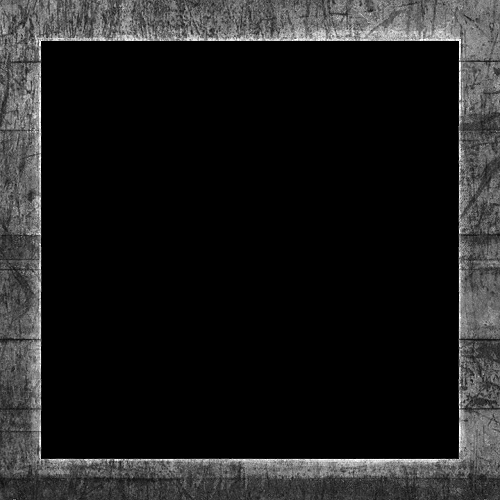

木头部分没有镜面高光效果, 所以是黑色的, 外面的金属框有镜面高光效果, 所以其颜色为灰色.

严格来说, 木头也是有高光效果的, 只是非常微弱, 大部分都被散射掉了. 将高光效果设置成了0

用神器PS或者其他的软件就能做出一张合格的纹理图.

先来把片元着色器中得代码改一改:

```glsl
struct Material {
    sampler2D diffuse;
    sampler2D specular;
    float shininess;
};
...
vec3 specular = light.specular * (spec * vec3(texture(material.specular, TexCoords)));
...
```

将材质中的镜面高光改成纹理采样, 计算镜面高光的时候也改成纹理采样.

```c
unsigned int specularMap = loadTexture("container2_specular.png");
lightingShader.setInt("material.specular", 1);
...
glActiveTexture(GL_TEXTURE1);
glBindTexture(GL_TEXTURE_2D, specularMap);
```

编译运行, 效果就正常好多了

## 三种光源类型

之前的文章中, 我们把光源定义成空间的一点. 效果确实不错, 但是还不足以模拟现实世界中的大部分光源. 一个简单的例子, 它无法模拟太阳光. 在本章中, 我们会介绍3种模拟真实世界中光源的模型, 使用这三种模型我们可以模拟绝大部分的光源. 这三种光源模型是: 方向光, 点光源, 聚光灯.

### 方向光(Directional Light)

方向光模型模拟的是一个非常远的地方发射出来的光. 在非常远的距离上, 到物体上就近似于平行. 想想太阳光, 太广距离地球大约1.5亿公里, 地球的半径是6378公里, 算起来, 太阳光照射的角度范围大约只有0.0024度, 照到地球的时候和平行也没什么区别了.

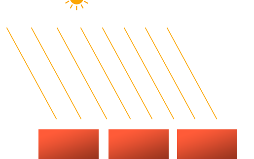

 由于光线都是平行照射, 光照效果也就和光源位置无关. 所以, 方向光的模型需要的是一个方向参数而不是位置, 着色器在计算的时候也几乎相同. 我们来改一下光源结构:

```glsl
struct Light {
    vec3 direction;
    vec3 ambient;
    vec3 diffuse;
    vec3 specular;
};

void main() {
    ...
    vec3 lightDir = normalize(-light.direction);
    ...
}
```

注意我们要光线方向的反方向用于计算角度. 那为啥不直接指定反方向呢? 这是一个习惯的问题, 说到方向光, 我们最直接的反应就是光线方向, 这最符合我们的逻辑认识.

要观察方向光德效果, 我们需要在之前显示3D盒子章节中的10个盒子. 回忆一下之前的章节, 首先我们要需要10个不同的位置:

```c
glm::vec3 cubePositions[] = {
    glm::vec3( 0.0f,  0.0f,  0.0f), 
  glm::vec3( 2.0f,  5.0f, -15.0f), 
  glm::vec3(-1.5f, -2.2f, -2.5f),  
  glm::vec3(-3.8f, -2.0f, -12.3f),  
  glm::vec3( 2.4f, -0.4f, -3.5f),  
  glm::vec3(-1.7f,  3.0f, -7.5f),  
  glm::vec3( 1.3f, -2.0f, -2.5f),  
  glm::vec3( 1.5f,  2.0f, -2.5f), 
  glm::vec3( 1.5f,  0.2f, -1.5f), 
  glm::vec3(-1.3f,  1.0f, -1.5f)
};
```

还需要10个把模型从局部空间转换到世界空间的模型矩阵:

```c
for (unsigned int i = 0; i < 10; i++) {
    glm::mat4 model;
    model = glm::translate(model, cubePositions[i]);
    float angle = 20.0f * i;
    model = glm::rotate(model, glm::radians(angle), glm::vec3(1.0f, 0.3f, 0.5f));
    lightingShader.setMat4("model", model);
    
    glDrawArrays(GL_TRIANGLES, 0, 36);
}
```

最后, 别忘了设置方向光, 你可以在主循环外面, 也可以在主循环里面设置. 当然, 之前对光源位置的引用也都需要删除.

```c
lightingShader.setVec3("light.direction", -0.2f, -1.0f, -0.3f);
```

编译运行, 看上去像是从天上有光照下来把这些箱子照亮了.

### 点光源(Point Light)

方向光通常用来模拟整个场景接收的全局光照, 但是除了全局光照之外, 我们通常还需要一些小的光源, 例如一个灯泡之类的. 这些光源就是点光源. 点光源常常被设置在某个位置上, 然后随着离距离的变远光照强度变小.

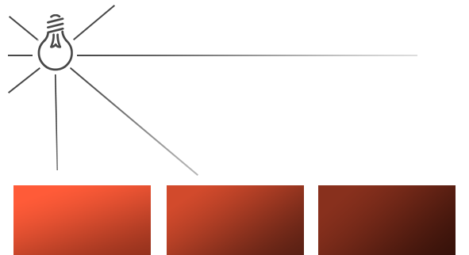

之前的章节里, 我们用到了最简单的点光源. 这个点光源有个缺点, 就是光照不会随着距离减弱, 反而好像是越来越强了. 这显然是不符合常理的. 在大多数3D场景中, 我们希望的点光源是像现实生活中那样, 只能照亮周围一下片区域.

如果实现过之前章节中的10个盒子, 你可能会注意到盒子背面的亮度和前面的亮度是一致的, 因为我们没有对光照的强度进行衰减. 光照应该是随着距离越远越弱.

#### 衰减(Attenuation)

随着距离的变远光照强度减弱的过程我们称之为衰减. 一个简单的方法是直接采用碱性衰减: 设定一个衰减比例, 随着距离减少强度. 但是这种衰减不符合现实的情况, 现实情况是光照会在短距离之内迅速衰减, 然后缓慢衰减直至消失. 没错, 这更像是一种二次衰减模型.

幸运的是, 有一些聪明的前辈已经将这个衰减公式给计算出来了. 我们直接就能使用:

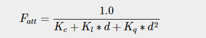

这里的d表示距离(distance), 是片元到光源的距离. 公式中包含了3个常熟因子, 分别是Kc, Kl 和 Kq. 这三个因子分别是常数衰减指数, 线性衰减指数, 二次项衰减指数.


因为二次项的衰减会比前面的线性和常数衰减快很多, 造成的结果就是在离光源近的地方会很亮, 然后离开光源, 亮度迅速衰减, 到一定程度后衰减又会减慢. 这个过程看来就是像这个样子:

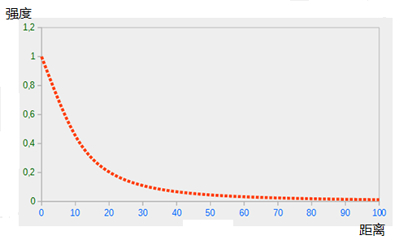

3个衰减因子到底应该选多少呢?

衰减因子取决于很多因素: 环境, 你期望光源覆盖的范围, 光的类型等等. 大多数情况下, 这是一个经验和微调的问题. 下面一张表里给出了覆盖范围和衰减因子的取值关系, 这些值是非常好的微调基准值

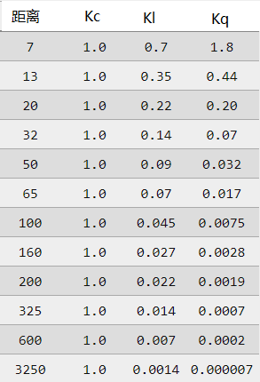

就像你看到的这样, Kc永远是1, Kl随着覆盖范围增大变得非常小, 而Kq变小的就更快了. 有时间试试这些值, 对渲染场景的影响. 在本文中, 我们选择覆盖范围是50.

实现点光源效果. 光源的位置属性, 再往Light结构中添加三个float变量表示3个不同的衰减因子, 这些因子可以通过主函数设置.

```glsl
struct Light {
    //vec3 direction;
    vec3 position;
    
    vec3 ambient;
    vec3 diffuse;
    vec3 specular;
    
    float constant;
    float linear;
    float quadratic;
};
```

然后我们就可以在主函数中设置这些值了, 对照上面的表, 我们的3个衰减因子分别设置为: 1.0f, 0.09f, 0.032f

```c
lightingShader.setFloat("light.constant", 1.0f);
lightingShader.setFloat("light.linear", 0.09f);
lightingShader.setFloat("light.quadratic", 0.032f);
```

将衰减值应用到光照中去也非常简单, 只要计算出衰减值, 然后乘上ambient, diffuse和specular分量就行了.

先计算衰减值. 我们要用到片元距离光源的距离, 这就要用到GLSL内置的length函数了, 这个函数作用是计算一个向量的长度, 我们把光源位置和片元位置做减法就可以得到这个向量.

```glsl
float distance = length(light.position - FragPos);
float attenuation = 1.0 / (light.constant + light.linear * distance + light.quadratic * (distance * distance));
ambient *= attenuation;
diffuse *= attenuation;
specular *= attenuation;
```

### 聚光灯(Spot Light)

聚光灯模型, 模拟的是手电筒, 探照灯之类可以把光汇聚到一个方向的光源. 它用到了平行光和点光源的部分内容, 我们在设置聚光灯的时候, 需要设置其位置和朝向, 并且光照强度会随着距离而减小. 特别的地方是, 聚光灯的光只会对某个方向上的有限圆锥角的物体有照亮效果, 如下图所示:

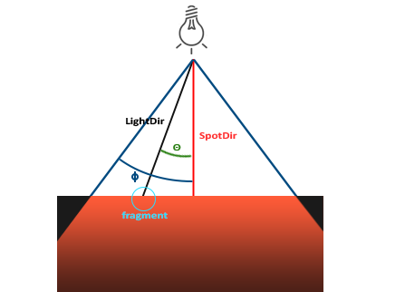

* LightDir(光照方向): 表示光源到片元的方向
* SpotDir(聚光灯朝向): 表示聚光灯前方的方向, 也就是影响方向
* Phi: 范围角度, 所有在这个角度范围之外的物体都不会被照亮
* Theta: 光照方向和聚光灯朝向的夹角, 用来计算光照强度

#### 实现一个手电筒

```glsl
struct Light {
    vec3 position;
    vec3 direction;
    float cutOff;
    ...
};
```

设置这些值:

```c
lightingShader.setVec3("light.position", camera.Position);
lightingShader.setVec3("light.direction", camera.Front);
lightingShader.setVec3("light.curOff", glm::cos(glm::radians(12.5f)));
```

可以看到, 我们是用cos角度值来代替原本的角度, 因为这样比较简单. 我们可以直接计算光照方向和聚光灯方向的点积, 然后和这个数值进行比较从而得出该店是否接收光照这个结论.

现在, 我们在片元着色器里计算片元和光源之间的方向与聚光灯朝向之间的夹角是否超过了照射范围:

```glsl
float theta = dot(lightDir, normalize(-light.direction));
if (theta > ligth.cutOff) {
    // 在照射范围内
} else {
    FragColor = vec4(light.ambient * vec3(texture(material.diffuse, TexCoords)), 1.0);
}
```

注意, cos的值随着角度变大而逐渐变小, 所以判断的方式是theta > light.cutOff表示在照射范围内.

编译运行, 效果看上去有点假, 不够真实.

#### 平滑边缘

为了创建一个平滑的边缘效果, 我们需要改变一下聚光灯的模型, 模拟聚光灯的内锥角和外锥角. 计算方式也会有所改变.

假设内锥角为ϕ，外锥角为γ， 光照角度为θ，我们的光照强度的计算公式就是
$$
I = (θ - γ) / cos(ϕ - γ)
$$
结果I 就表示当前片元的光照强度

让我们来看计算代码:

```glsl
struct Light {
    ...
    float outerCutOff;
};

// 聚光灯
// 计算片元角度的cos值
float theta = dot(lightDir, normalize(-light.direction));
// 计算epsilon的值, 用内锥角的cos值减去外锥角的cos值
float epsilon = light.cutOff - light.outerCutOff;
// 根据公式计算光照强度, 并限制结果的范围
float intensity = clamp((theta - light.outerCutOff) / epsilon, 0.0, 1.0);

diffuse *= intensity;
specular *= intensity;
```

强度被限制在0到1之间, 这是必要的, 因为theta-light.outerCutOff的值可能是负数

最后, 设置内锥角度为12.5度, 外锥角度为17.5度, 设置代码如下:

```c
lightingShader.setFloat("light.cutOff", glm::cos(glm::radians(12.5f)));
lightingShader.setFloat("light.outerCutOff", glm::cos(glm::radians(17.5f)));
```

编译运行, 效果就正常且有趣多了.


